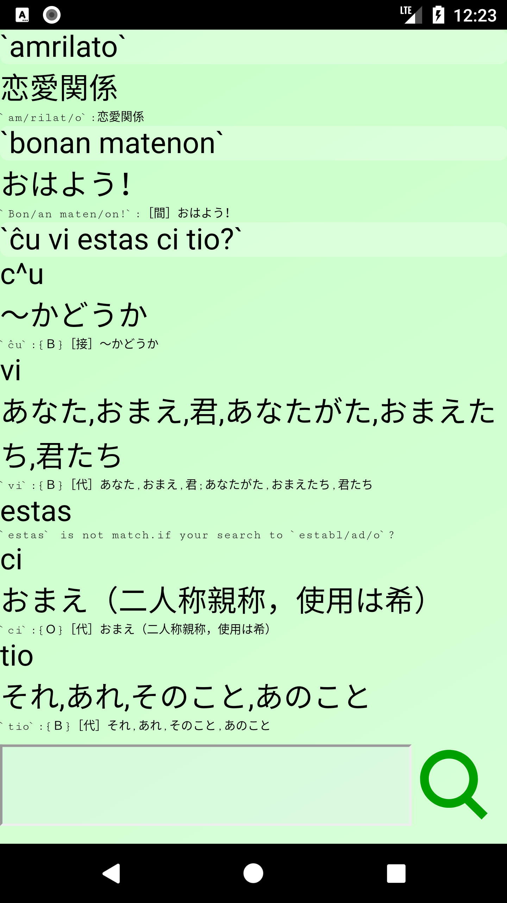

lina\_dicto for android (2018)
====
\- Dictionary of Japanese / Esperanto fo android -

# About
日本語/Esperanto辞書アプリケーション[lina\_dicto](https://github.com/michinarinukazawa/lina_dicto)のAndroid版です。  
([旧版]( https://github.com/michinarinukazawa/lina_dicto_for_android )から、Android Studio更新に追従するため新規に起こし直したものです。)  

# Screenshot/Image
  

# Get lina\_dicto for android
[Google Play Storeにて公開中]( https://play.google.com/store/apps/details?id=com.michinari_nukazawa.app.lina_dicto_for_android )。  
Google Play Store install QR code.  
  

## Build
get this project repository.
get [lina\_dicto](https://github.com/michinarinukazawa/lina_dicto) project by github.  
run `make` in this project. make is lina\_dicto copy and change for android environment.  
Build this application in Android Studio.  

## License
MIT  

# Contact
mail: [michinari.nukazawa@gmail.com][mailto]  
twitter: [@MNukazawa][twitter]  

Develop by Michinari.Nukazawa, in project "[daisy bell][pixiv_booth_project_daisy_bell]".  

[pixiv_booth_project_daisy_bell]: https://daisy-bell.booth.pm/
[mailto]: mailto:michinari.nukazawa@gmail.com
[twitter]: https://twitter.com/MNukazawa

